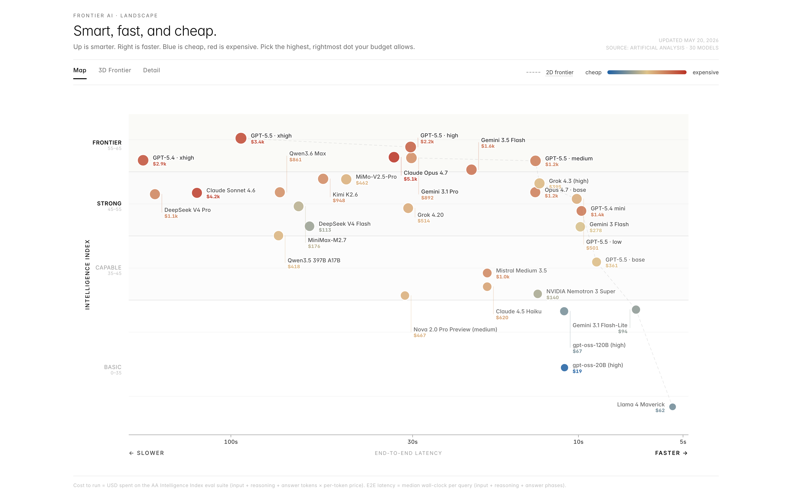

# ai-analysis

A chart for comparing frontier AI models on the three things that actually matter: intelligence, end-to-end latency, and real cost to run.



## Why

The existing AI comparison charts are all a bit off. They use token price as a stand-in for cost, which hides how much reasoning models really burn through on a task. Or they treat speed as tokens-per-second, which doesn't capture the wait you actually feel. So this one uses the numbers Artificial Analysis publishes for both: cost-to-run across the AA Intelligence Index suite, and median end-to-end response time per query.

- **Intelligence** is the Y axis (AA Intelligence Index).
- **End-to-end latency** is the X axis. Log scale — wait-time is felt logarithmically.
- **Cost to run** is the colour. Log scale — budgets are felt multiplicatively.

## Run it

```sh
npm install
cp .env.example .env   # paste your Artificial Analysis API key
npm run fetch          # pull latest model numbers and refresh docs/screenshot.png
npm run dev            # opens the chart in your browser
```

The pinned model list lives at the top of `scripts/fetch-models.ts`. `npm run fetch` also scans the Artificial Analysis homepage Intelligence Index chart, auto-adds any curated models that have complete chart metrics, and regenerates the README screenshot. Rows with missing cost or latency are skipped so they cannot break the log-scaled chart.
