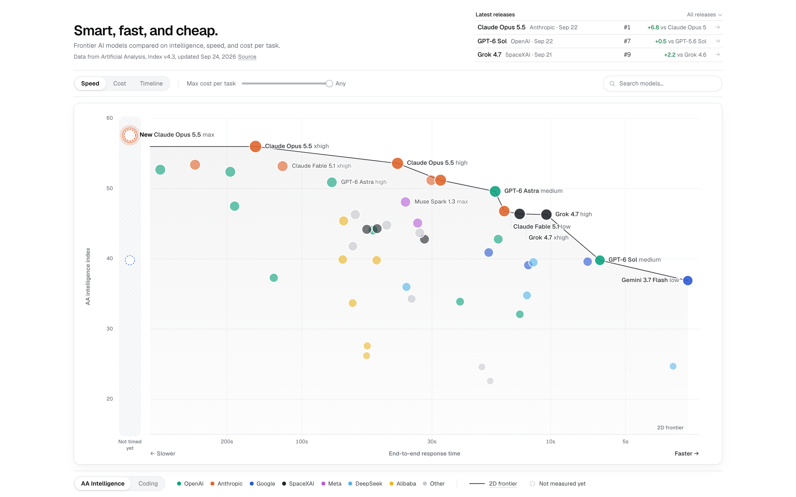

# ai-analysis

A chart for comparing frontier AI models on the three things that actually matter: intelligence, end-to-end response time, and cost per task.



## Why

The existing AI comparison charts are all a bit off. They use token price as a stand-in for cost, which hides how much reasoning models really burn through on a task. Or they treat speed as tokens-per-second, which doesn't capture the wait you actually feel. So this one uses the numbers Artificial Analysis publishes: cost per Intelligence Index task and median end-to-end response time per query.

- **Intelligence** is the Y axis (AA Intelligence Index, or AA Coding Index via the toggle).
- **The X axis is switchable**: end-to-end response time, cost per task, or release date. Speed and cost use log scales — wait-time and budgets are both felt multiplicatively.
- **The third variable is the colour** (cost on the speed view, wait on the cost view), with the legend labelled with the actual min/max values in the data.

## Views

- **Speed** (default): up is smarter, right is faster, colour is cost. The dashed line is the Pareto frontier — models no other model beats on both axes.
- **Cost**: up is smarter, right is cheaper per task, colour is wait.
- **Timeline**: every benchmarked model by release date. The dashed line is the record line — each step is the model that raised the all-time intelligence record when it shipped.
- **Limits**: set a max wait and/or max cost per task; everything that doesn't fit fades out and the smartest model that does gets flagged as the top pick.
- **Find alternatives**: choose the model you use now to get a ranked shortlist of five, based on capability, response time, and task cost. Pick any of them — or click any dot — to focus the chart on a direct comparison.
- **Relative comparison stats**: the comparison strip reports differences the way you'd repeat them out loud — "+3.3 intelligence", "1.3× faster", "1.4× pricier per task" — never raw cents or seconds, which mean nothing out of context.
- **Share a comparison**: the current model and considered alternative are saved in the URL. Shared links reopen with both points emphasized, a directional connector, and the surrounding models de-emphasized for context.

## Reading the map

The default view is a landscape, not a full census: recent releases plus the frontier, capped so the field stays legible, with a limited number of variants per model family. The value axis is cropped to the models actually drawn rather than anchored at zero, and models far below the pack are demoted out of the default view — search or a comparison brings any of them back.

Every control is mirrored into the URL hash, so any view — a metric, a search, a set of limits, a comparison — is shareable by copying the address.

## Run it

```sh
npm install
cp .env.example .env   # paste your Artificial Analysis API key
npm run fetch          # pull latest model numbers and refresh docs/screenshot.png
npm run dev            # opens the chart in your browser
```

`npm run fetch` discovers the model list from the live Artificial Analysis API and model metrics payload, then regenerates the local data file and README screenshot. Rows without the selected Y-axis metric are not plotted for that view. Priced rows without end-to-end response time sit on the timing n/a rail; rows without cost per task use a neutral color when surfaced by search.

The scheduled deploy checks for fresh data four times an hour and archives a dated copy whenever it changes, so day-by-day snapshots accumulate in the repo.
