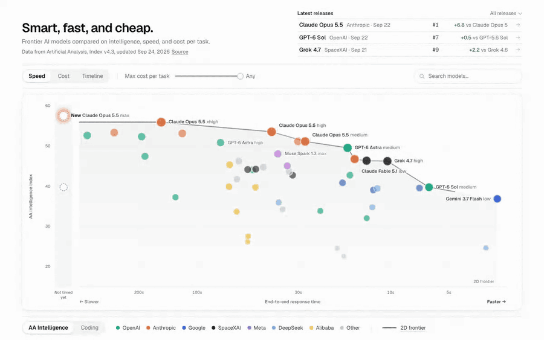
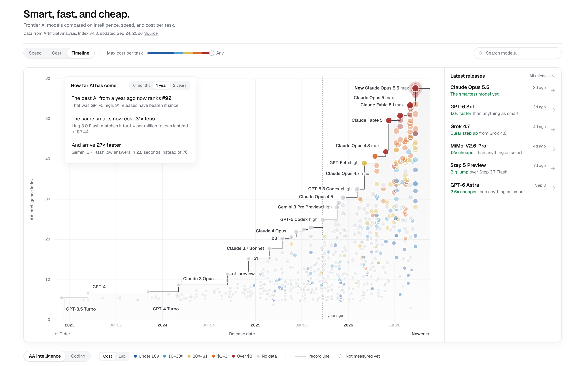

# Smart, fast, and cheap.

**Which AI model should you actually use?** One map of every frontier model on the three things that matter: how smart it is, how long you wait, and what a task really costs.

**[Open the live map →](https://ethangreeney.github.io/ai-analysis/)**



## Read it in a glance


**Up is smarter. Right is faster. Color is cost per task**, from blue under 10¢ to red over $3, so you can spot smart, fast *and* cheap at a glance. One click switches the colors to the lab instead. The line is the frontier: models no other model beats on both axes. If a model isn't on the line, something is smarter *and* faster. Models not timed yet sit in their own lane on the left instead of pretending to be slow.

Flip the axis to **Cost** to see smart-and-cheap instead, or **Timeline** to watch the intelligence record get broken release by release.

## See how fast it's moving

The timeline answers **"how much better is today than a year ago?"** in three numbers: how much smarter the best model got, and how much cheaper and faster last year's best is to match now. Click any of them to open that exact comparison.



## Set a budget

Drag the budget slider left. Everything pricier fades out, and the frontier redraws to show **the best you can get for that much**.


## Compare what you use now

Click any dot, then a second one, or click a release under **Latest releases** to see it against the version it replaces. The card says it in plain terms: **+6.8 intelligence, about the same cost per task.** Copy the link and the whole comparison travels with it.


## Why these numbers

Most comparison charts use **token price** and **tokens per second**. Both mislead for reasoning models, which quietly burn thousands of tokens thinking. This map uses what [Artificial Analysis](https://artificialanalysis.ai) measures end to end: **cost per Intelligence Index task** and **median response time per query**. Those are the numbers you feel on the bill and in the wait.

Data refreshes automatically several times an hour, new models appear the day Artificial Analysis publishes them, and every day's snapshot is archived in this repo.

## Run it locally

```sh
npm install
cp .env.example .env   # add your Artificial Analysis API key
npm run fetch          # pull the latest numbers
npm run dev
```
