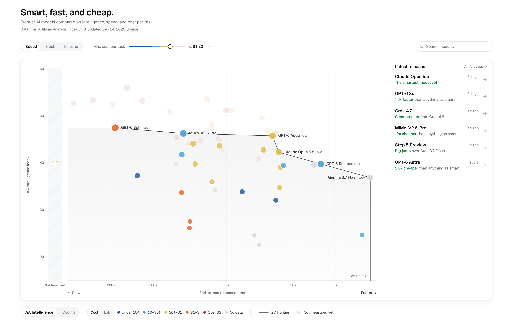
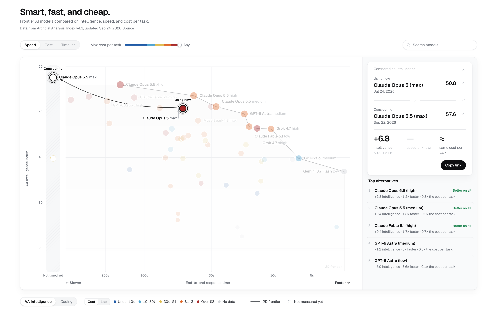

# Smart, fast, and cheap.

**Which AI model should you actually use?** One map of every frontier model on the three things that matter: how smart it is, how long you wait, and what a task really costs.

**[Open the live map →](https://ethangreeney.github.io/ai-analysis/)**


## Read it in a glance

**Up is smarter. Right is faster. Color is cost.** The dashed line is the frontier: models no other model beats on both axes. If a model isn't on the line, something is smarter *and* faster.

Flip the axis to **Cost** to see smart-and-cheap instead, or **Timeline** to watch the intelligence record get broken release by release.

## Set a budget

Drag the cost cap in from the right. Everything pricier fades to a ghost, and the frontier redraws to show **the best you can get for that much**.



## Compare what you use now

Click any dot, then a second one. The card says it in plain terms: **+1.6 intelligence, 3.5× faster, 0.2× the cost per task.** Copy the link and the whole comparison travels with it.



## Why these numbers

Most comparison charts use **token price** and **tokens per second**. Both mislead for reasoning models, which quietly burn thousands of tokens thinking. This map uses what [Artificial Analysis](https://artificialanalysis.ai) measures end to end: **cost per Intelligence Index task** and **median response time per query**. Those are the numbers you feel on the bill and in the wait.

Data refreshes automatically several times an hour, new models appear the day Artificial Analysis publishes them, and every day's snapshot is archived in this repo.

## Run it locally

```sh
npm install
cp .env.example .env   # add your Artificial Analysis API key
npm run fetch          # pull the latest numbers
npm run dev
```
